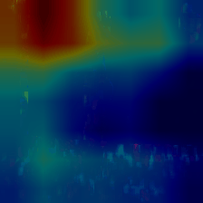
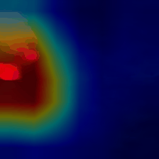
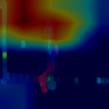
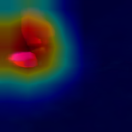
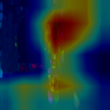
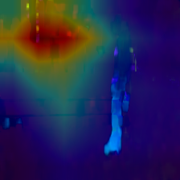
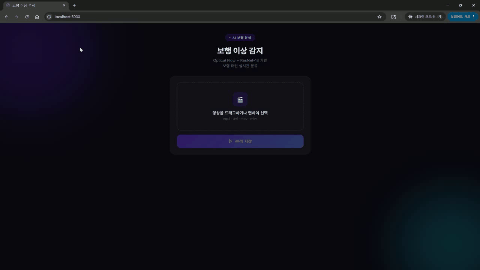
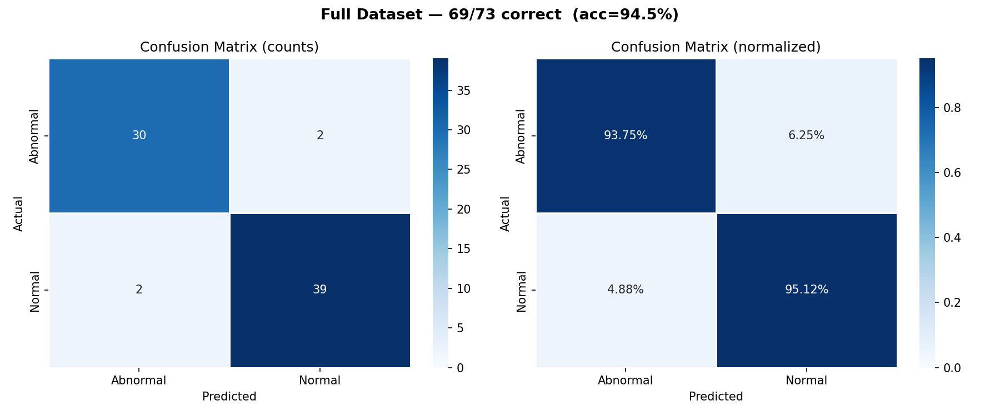
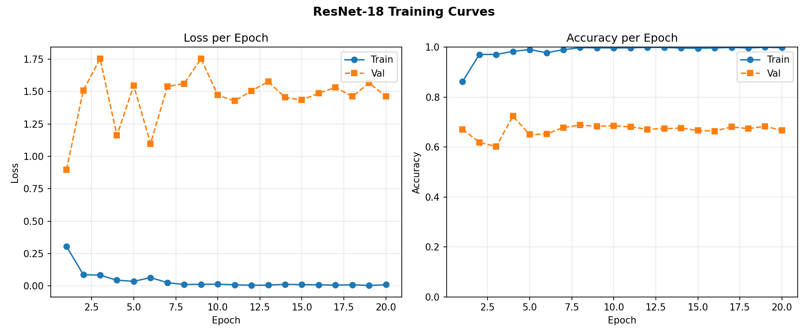

# Gait Analysis — Normal vs Abnormal Classification

Optical Flow + CNN (ResNet-18) + Grad-CAM 기반 보행 이상 이진 분류 파이프라인.

## 파이프라인 완료 현황

| 단계 | 스크립트 | 상태 | 결과 |
|------|---------|------|------|
| 1. Optical Flow 추출 | `01_extract_optical_flow.py` | 완료 | 2,190장 생성 |
| 2. CNN 학습 | `02_train_cnn.py` | 완료 | Acc 72.38%, F1 0.724 |
| 3. Grad-CAM 시각화 | `03_gradcam.py` | 완료 | 샘플 10장 생성 |
| 4. 단일 영상 진단 | `04_diagnosis.py` | 완료 | Normal 98.73% / Abnormal 99.47% |
| 5. Confusion Matrix 시각화 | `05_confusion_matrix.py` | 완료 | **전체 94.5%** (Normal 95.1% / Abnormal 93.8%) |
| 6. GradCAM GIF 생성 | `06_gradcam_gif.py` | 완료 | Normal / Abnormal 대표 영상 GIF 각 1개 |

## 폴더 구조

```
data/
  01_Normal/              원본 정상 보행 영상 (41개)
  02_Abnormal/            원본 이상 보행 영상 (32개)

output/
  optical_flow/           Step 1 — Farneback Optical Flow 이미지
    Normal/                 영상당 30프레임 × 41개
    Abnormal/               영상당 30프레임 × 32개
  models/                 Step 2 — 학습된 가중치 (cnn_best.pth)
  results/
    gradcam/              Step 3 — Grad-CAM 히트맵 샘플 (클래스별 5장)
    diagnosis_*.json      Step 4 — 진단 리포트 (JSON)
  demo/                   데모 영상 (GIF)

src/
  01_extract_optical_flow.py
  01b_extract_optical_flow_crop.py
  02_train_cnn.py
  03_gradcam.py
  04_diagnosis.py
  05_confusion_matrix.py
  06_gradcam_gif.py
  app.py                  Flask 웹 데모 서버

templates/
  index.html              웹 데모 UI

archive/                  이전 파이프라인 파일 백업
```

## 실행 순서

### Step 1. Optical Flow 추출
```bash
python src/01_extract_optical_flow.py
```
- Farneback Optical Flow → HSV 색상 맵으로 변환 후 저장
- 영상당 30프레임 추출 (보행 1사이클 ≈ 1초, 30fps 기준 1사이클을 완전히 커버하는 최소 단위. 학습·진단 조건 통일)
- 결과: `output/optical_flow/{Normal,Abnormal}/<영상명>/`

### Step 2. CNN 학습
```bash
python src/02_train_cnn.py
```
- **영상 단위** 80/20 train/val 분리 (seed=42)
  - 동일 영상의 프레임이 train/val에 섞이지 않아 데이터 누수 방지
- ResNet-18 (ImageNet pretrained) fine-tuning
- 매 에포크 Loss / Accuracy / F1 출력, 완료 시 classification report 자동 출력
- 결과: `output/models/cnn_best.pth`

### Step 3. Grad-CAM 시각화
```bash
python src/03_gradcam.py
```
- `model.layer4` 기준 Grad-CAM 히트맵 생성
- 각 클래스에서 비디오당 중간 프레임 1장 샘플링 (기본 클래스당 5장)
- 파일명에 예측 클래스·신뢰도 포함 (`_predNormal_0.97.png`)
- 결과: `output/results/gradcam/{Normal,Abnormal}/`

**Grad-CAM 애니메이션** (30 frames, 10 fps)

<table>
  <tr>
    <th>Normal — S01_Norm_S_01 (신뢰도 0.97)</th>
    <th>Abnormal — A01_Act_S_01 (신뢰도 1.00)</th>
  </tr>
  <tr>
    <td></td>
    <td></td>
  </tr>
</table>

**Grad-CAM 샘플 (정지 이미지)**

<table>
  <tr>
    <th>Normal (신뢰도 0.97)</th>
    <th>Abnormal (신뢰도 1.00)</th>
  </tr>
  <tr>
    <td></td>
    <td></td>
  </tr>
  <tr>
    <td></td>
    <td></td>
  </tr>
</table>

### Step 4. 단일 영상 진단
```bash
python src/04_diagnosis.py --video <영상 경로>
```
- 입력 영상 → Optical Flow 추출 → 30프레임 평균 추론 → JSON 리포트 저장
- 결과: `output/results/diagnosis_<영상명>.json`

## Flask 웹 데모

Optical Flow 추출 → 프레임별 추론 → GradCAM 히트맵 + 신뢰도 그래프를 실시간으로 시각화하는 모바일 친화적 웹 데모.

```bash
python src/app.py
# http://localhost:5000 접속
```

| Normal 보행 | Abnormal 보행 |
|:-----------:|:-------------:|
|  |  |

**주요 기능:**
- 영상 드래그앤드롭 업로드
- Optical Flow 30프레임 슬라이드쇼 재생
- 프레임별 Normal 확률 그래프 실시간 시각화
- Grad-CAM 히트맵으로 모델 주목 영역 확인

## 전체 데이터셋 진단 결과

> `04_diagnosis.py`로 전체 73개 영상 진단
> 결과 저장: `output/results/diagnosis_normal_full.json`, `output/results/diagnosis_abnormal_full.json`

### Confusion Matrix



**종합 요약**

| 클래스 | 영상 수 | 정확 | 오분류 | 정확도 |
|--------|--------|------|--------|--------|
| Normal   | 41 | 39 | 2 (`S11_Norm_S_02`, `S15_Norm_S_01`) | 95.1% |
| Abnormal | 32 | 30 | 2 (`A06_Abn_S_01`, `A15_Abn_B_01`)   | 93.8% |
| **전체** | **73** | **69** | **4** | **94.5%** |

**Normal 신뢰도 분포** (Normal 확률 기준)

| 구간 | 건수 | 비율 |
|------|------|------|
| 0.9 ~ 1.0 (매우 확실) | 30개 | 73.2% |
| 0.7 ~ 0.9 (확실)      | 8개  | 19.5% |
| 0.5 ~ 0.7 (불확실)    | 1개  | 2.4%  |
| 0.0 ~ 0.5 (오분류)    | 2개  | 4.9%  |

| 통계 | 값 |
|------|-----|
| 평균 신뢰도 | 0.893 |
| 중앙값     | 0.953 |
| 최솟값     | 0.085 |
| 최댓값     | 0.999 |
| 표준편차   | 0.171 |

**Abnormal 신뢰도 분포** (Abnormal 확률 기준)

| 구간 | 건수 | 비율 |
|------|------|------|
| 0.9 ~ 1.0 (매우 확실) | 27개 | 84.4% |
| 0.7 ~ 0.9 (확실)      | 2개  | 6.3%  |
| 0.5 ~ 0.7 (불확실)    | 1개  | 3.1%  |
| 0.0 ~ 0.5 (오분류)    | 2개  | 6.2%  |

| 통계 | 값 |
|------|-----|
| 평균 신뢰도 | 0.930 |
| 중앙값     | 0.997 |
| 최솟값     | 0.204 |
| 최댓값     | 1.000 |
| 표준편차   | 0.180 |

## 진단 예시

**Normal 영상** (`S01_Norm_S_01.mp4`)
```json
{
  "prediction": "Normal",
  "confidence": { "Abnormal": 0.0127, "Normal": 0.9873 },
  "frames_analyzed": 30
}
```

**Abnormal 영상** (`A01_Act_S_01.mp4`)
```json
{
  "prediction": "Abnormal",
  "confidence": { "Abnormal": 0.9947, "Normal": 0.0053 },
  "frames_analyzed": 30
}
```

## 모델 평가 결과

> ResNet-18, 20 epochs, video-level 80/20 split (seed=42)
> Train: 59 videos (1,770 frames) / Val: 14 videos (420 frames)

### Training Curve



### 원본 vs Person-Crop 비교

MediaPipe Pose로 사람 영역만 crop해 배경을 제거한 후 재학습한 실험 결과.

| 지표 | 원본 Optical Flow | Person Crop |
|------|:-----------------:|:-----------:|
| Best val Accuracy | **72.38%** | **72.38%** |
| Best epoch | 20 | 4 |
| Train Acc (최종) | ~99% | ~100% |
| Abnormal Precision | 0.68 | 0.71 |
| Abnormal Recall | 0.68 | 0.61 |
| Normal Precision | 0.76 | 0.73 |
| Normal Recall | 0.75 | 0.81 |

**결론:** Crop 전처리는 val accuracy에는 영향 없음. Epoch 2에서 train acc가 97%로 포화되는 극단적 과적합이 근본 원인으로, 데이터 73개 대비 ResNet-18(1,100만 파라미터)의 모델 용량 불균형이 병목.

### 원본 모델 분류 리포트

| 클래스 | Precision | Recall | F1 | Support |
|--------|-----------|--------|----|---------|
| Abnormal | 0.68 | 0.68 | 0.68 | 180 frames (6 videos) |
| Normal   | 0.76 | 0.75 | 0.76 | 240 frames (8 videos) |

**Confusion Matrix (Validation Set)**

|  | Pred Abnormal | Pred Normal |
|--|:---:|:---:|
| True Abnormal | 123 | 57 |
| True Normal   | 59  | 181 |

> 프레임 단위 split 사용 시 acc 100% (데이터 누수) → 영상 단위 split 교정 후 72.4%

## 데이터셋

| 클래스 | 영상 수 | Optical Flow 이미지 수 |
|--------|--------|----------------------|
| Normal   | 41 | 1,230 |
| Abnormal | 32 | 960 |
| **합계** | **73** | **2,190** |

## 환경

- Python 3.10
- OpenCV 4.13
- PyTorch 2.12 (CPU)
- torchvision 0.27
- scikit-learn 1.x
- Flask 3.x

```bash
python -m venv venv
venv\Scripts\activate
pip install torch torchvision --index-url https://download.pytorch.org/whl/cpu
pip install opencv-python numpy scikit-learn flask
```

### Flask 웹 데모 실행

```bash
python src/app.py
# http://localhost:5000 접속
```

## 한계점

### 1. 파킨슨 확진 환자 보행 영상 데이터 부재
- 공개된 파킨슨 보행 영상 데이터셋이 전 세계적으로 극히 제한적
- Figshare 공개 데이터셋(35명, 73개 영상) 확인했으나 360도 회전 동작만 포함, 직선 보행 데이터 없음
- 결과적으로 Normal vs Abnormal 이진 분류로 접근
- Abnormal이 파킨슨 특이적 보행이 아닐 수 있음

### 2. 소규모 데이터셋으로 인한 과적합
- 73개 영상, ResNet-18 1,100만 파라미터
- Train Acc 99% vs Val Acc 72%로 과적합 발생
- Person Crop 전처리 추가했으나 개선 없음
- 데이터 수 자체가 근본 원인

### 3. 외부 검증 데이터 부재
- 학습/검증 모두 동일 출처 데이터
- 완전히 다른 환경에서 촬영된 영상으로 검증 필요

### 4. 향후 연구 방향
- 병원 협력을 통한 파킨슨 확진 환자 직선 보행 영상 수집
- EEG 등 생체신호와 멀티모달 융합
- 더 많은 데이터 확보 후 경량 모델(MobileNet)로 모바일 온디바이스 배포

## References

### 기법 및 모델

- He, K., Zhang, X., Ren, S., & Sun, J. (2016). **Deep Residual Learning for Image Recognition**. CVPR 2016.
- Selvaraju, R. R., et al. (2017). **Grad-CAM: Visual Explanations from Deep Networks via Gradient-based Localization**. ICCV 2017.
- Farnebäck, G. (2003). **Two-Frame Motion Estimation Based on Polynomial Expansion**. SCIA 2003.
- Lugaresi, C., et al. (2019). **MediaPipe: A Framework for Building Perception Pipelines**. Google LLC.

### 라이브러리

- PyTorch / torchvision — https://pytorch.org
- OpenCV — https://opencv.org
- Flask — https://flask.palletsprojects.com

### 데이터셋

- Normal 및 Abnormal 보행 영상: YouTube 및 인터넷 공개 영상에서 수집. Accessed 2025–2026.
